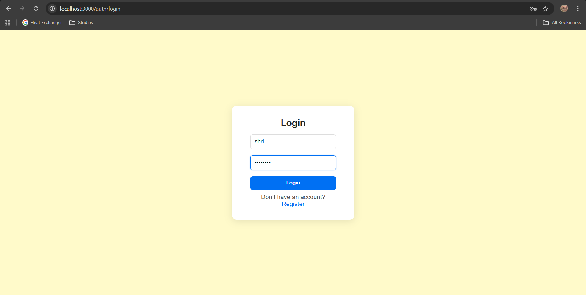
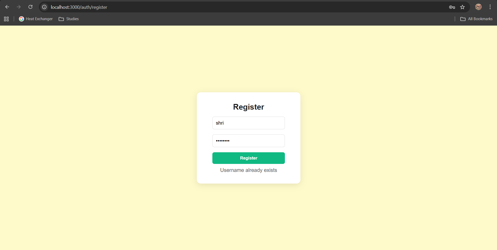
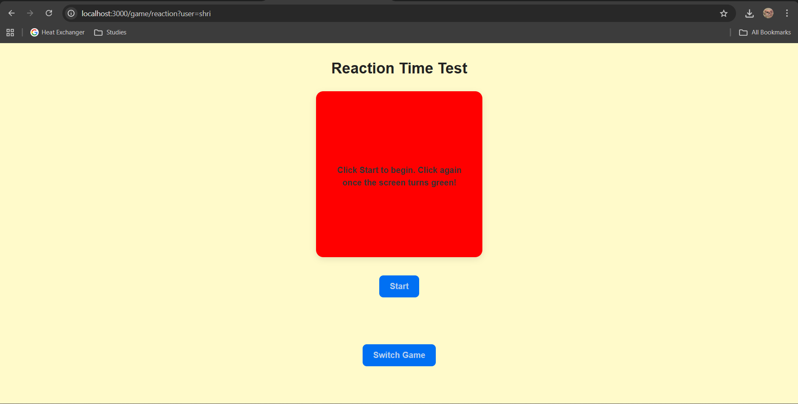
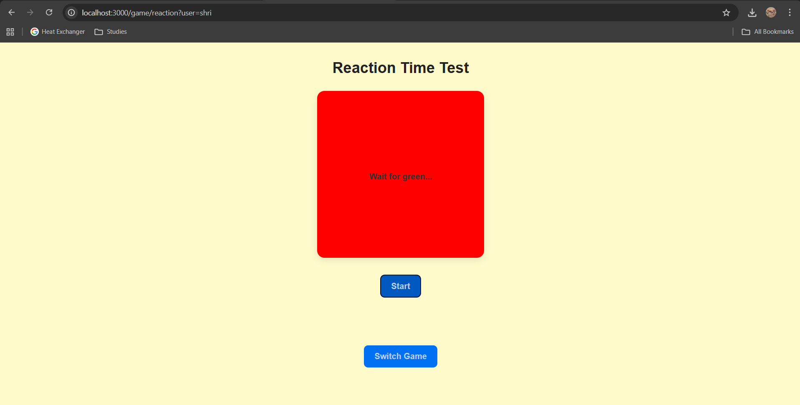
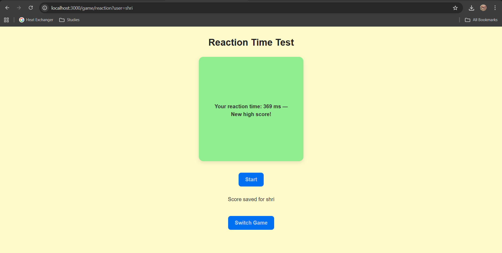

# ⚡ Reactivity

A simple web-based game built using **React.js**, **Node.js**, and **PostgreSQL**, where users can log in, switch between multiple minigames, and track their scores.

---

## 🚀 Features

- 🔐 **User authentication system**  
- 🎮 **Two fully playable minigames**:  
  - **Reaction Time Test** – measure how quickly you respond to a color change  
  - **Memory Match** – a 6×6 tile-matching puzzle using 18 themed images  
- 🔄 **Switch Game** button to swap between Reaction Time and Memory Match  
- 🧠 **High score tracking for both games**  
  - `reaction_time_score`  
  - `memory_match_score`  
- ⏱️ Memory Match includes a timer + automatic high score detection  
- 📊 Real-time score saving via backend  
- 🗄️ **PostgreSQL database integration**  
- 🔐 Environment handling via `.env`  

---

## 🎮 Minigames Overview

### 🎯 Reaction Time Test  
- Click as soon as the screen turns green  
- Tracks your reaction time in milliseconds  
- Saves score to `reaction_time_score`  
- Displays **New Highscore!** when your time improves  
- Clean UI with clear prompts and color states

---

### 🧠 Memory Match  
- A **6×6 grid** containing 18 pairs of shuffled tiles  
- Each tile corresponds to one of the following images:  
  `autumnleaf`, `basketball`, `books`, `chocolate`,  
  `christmastree`, `cupcake`, `domino`, `gameconsole`,  
  `jam`, `luffyhat`, `penguin`, `popcorn`,  
  `ship`, `snowman`, `sun`, `testtube`,  
  `umbrella`, `witchhat`

- Features include:
  - Tile reveal on click  
  - Automatic mismatch flipping  
  - Match counter  
  - Timer starts on the first click  
  - Timer stops on completing all 18 matches

---

## 🛠️ Tech Stack

- **Frontend:** Next.js (React)  
- **Backend:** Node.js with Express  
- **Database:** PostgreSQL  
- **Environment Variables:** `.env` file  

---

## 📸 Screenshots

- **Login**  
  

- **Register**  
  

- **Reaction Game – Initial State**  
  

- **Reaction Game – After Start**  
  

- **Reaction Game – Score**  
  

- **Reaction Game – New Highscore**  
  

---

### 🧩 Memory Match Screenshots

- **Memory Match Game – Initial State**  
  

- **Memory Match Game – During Play**  
  

- **Memory Match Game – Score**  
  